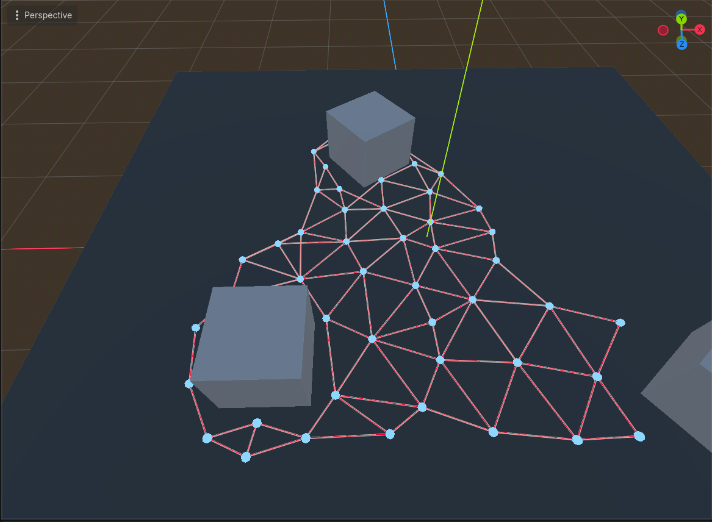
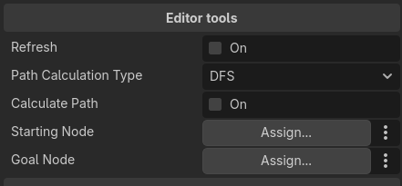
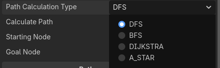

<h1>
 Navigation graph tool for Godot 4.6 C#
</h1>

 This is a tool made for the <a href="https://github.com/godotengine/godot/tree/master">Godot game engine</a> with C#
 for making simple navigation graphs for ai agents to use. The tool is designed to be used in 3D scenes, but could be changed pretty easily to 
 work with 2D ones. The tool also provides pathfinding between two given nodes.

 Pathfinding algorithms that are implemented: 
<ul>
  <li><a href="https://en.wikipedia.org/wiki/Depth-first_search">DFS</a> (Depth first search</li>
  <li><a href="https://en.wikipedia.org/wiki/Breadth-first_search">BFS</a> (Bredth first search)</li>
  <li><a href="https://en.wikipedia.org/wiki/Dijkstra%27s_algorithm">Dijkstra</a></li>
  <li><a href="https://en.wikipedia.org/wiki/A*_search_algorithm">A*</a></li>
</ul>

And since the pathfinding logic is in a seperate class, more can be added if needed.

<h2>
 Using the tool
</h2>

 The tool consists of the navigation graph scene that has to be in the scene for the path nodes to be added.

 To start using the tool, after adding all the scripts, scenes, materials and textures from this project to yours, drag into the scene from "scenes/objects/pathfinding" the 
 navigation_graph.tscn scene.

After the navigation graph has been added, it should teleport to the center of the scene.

 With the graph in the scene, we can now start adding path nodes, they are found in the same folder as the navigation graph. Add nodes by draging them into the scene or copy pasting 
 already existing ones in the scene. The nodes automatically connect by raycasting to each other when spawning in.

<h2>
 Testing out pathfinding
</h2>

 Since there is no implementation for agents in this project, there are tools to help test out the pathfinding algorithms.

 These tools are found when selecting the navigation graph. The refresh tool simply refreshes the graph, regenerating connections and recalculating paths if needed.
 Path calculation type is where we choose the pathfinding algorithm to use for our testing purposes.

 The calculate path button calculates a path between the starting and goal node that we give to the editor tool.

 <i>*Note - BFS, Dijkstra and A** usually have the same path, but the diffirence is the speed of calculation</i>

